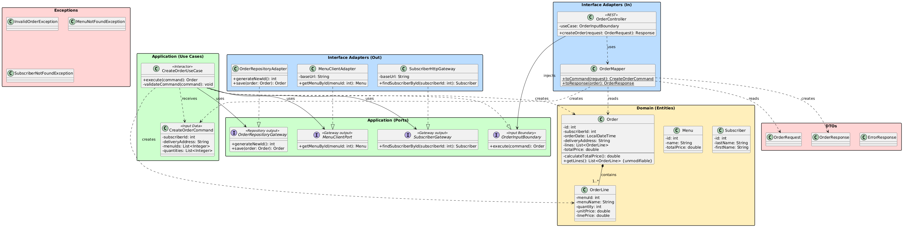

# 🛒 Microservice Commandes

> Service de gestion des commandes — Application de livraison de repas à domicile  
> Java · Jakarta EE · JAX-RS · Clean Architecture

---

## 📋 Présentation

Ce microservice fait partie d'une **architecture microservices** pour une application de livraison de repas.

**Son rôle** : gérer la création des commandes clients.

Il permet de :
- Recevoir une demande de commande (liste de menus + quantités + abonné)
- Appeler le **microservice Plats & Utilisateurs** pour valider l'abonné
- Appeler le **microservice Menus** pour récupérer les détails et les prix
- Calculer automatiquement le **prix total** de la commande
- Retourner une commande complète avec toutes les informations

Le service **ne stocke ni les abonnés ni les menus**. Il les récupère en temps réel ("Snapshots"), respectant ainsi la séparation stricte des responsabilités.

---

## ⚙️ Fonctionnalités

| Fonctionnalité | Description |
|---|---|
| Création de commande | À partir d'une liste d'IDs de menus, d'un ID d'abonné et de quantités |
| Appels inter-services | Récupération des données via HTTP (microservices Menus & Utilisateurs) |
| Calcul du prix total | Somme automatique (prix unitaire × quantité) par ligne |
| Validation | Vérification des données d'entrée (menus, quantités, adresse, validité de l'abonné) |
| Gestion d'erreurs | Réponses structurées (400 Bad Request, 404 Not Found) |

---

## 🏗️ Architecture

Le projet suit rigoureusement la **Clean Architecture** (Robert C. Martin) organisée en couches avec des responsabilités clairement séparées. Le code source est entièrement rédigé en **anglais métier**.

### Couches du projet

```text
┌─────────────────────────────────────────────┐
│  PRÉSENTATION (adapters/in)                 │
│  OrderController · OrderMapper              │
│  → Expose les endpoints REST                │
│  → Convertit DTO ↔ Domain                   │
├─────────────────────────────────────────────┤
│  APPLICATION (usecase)                      │
│  CreateOrderUseCase · CreateOrderCommand    │
│  OrderInputBoundary (interfaces/ports)      │
│  → Orchestre la logique applicative         │
│  → Définit les ports de sortie vers les API │
├─────────────────────────────────────────────┤
│  DOMAINE (domain)                           │
│  Order · OrderLine · Menu · Subscriber      │
│  → Entités métier immuables                 │
│  → Logique business pure (Composition)      │
├─────────────────────────────────────────────┤
│  INFRASTRUCTURE (adapters/out)              │
│  MenuClientAdapter · SubscriberHttpGateway  │
│  OrderRepositoryAdapter                     │
│  → Appels HTTP vers les microservices       │
│  → Implémente les ports de sortie           │
├─────────────────────────────────────────────┤
│  DTO (dto)                                  │
│  OrderRequest · OrderResponse               │
│  ErrorResponse                              │
│  → Objets de transfert JSON (entrée/sortie) │
└─────────────────────────────────────────────┘
```

### Structure du projet

```text
src/main/java/fr/univamu/iut/orderservice/
├── config/
│   └── AppConfig.java                  ← Composition Root (injection des dépendances)
├── adapters/
│   ├── in/
│   │   ├── OrderController.java        ← Endpoint REST
│   │   ├── OrderMapper.java            ← Conversion DTO ↔ Command/Domain
│   │   └── exception/                  ← Exception Mappers (404, 400)
│   └── out/
│       ├── MenuClientAdapter.java      ← Appel HTTP API Menus
│       ├── SubscriberHttpGateway.java  ← Appel HTTP API Utilisateurs
│       └── OrderRepositoryAdapter.java ← Sauvegarde en mémoire
├── usecase/
│   ├── CreateOrderUseCase.java         ← Logique applicative (Interactor)
│   ├── CreateOrderCommand.java         ← Objet de commande (Input Data)
│   └── port/                           ← Interfaces des ports d'entrée/sortie
│       ├── OrderInputBoundary.java
│       ├── MenuClientPort.java
│       ├── SubscriberGateway.java
│       └── OrderRepositoryGateway.java
├── domain/
│   ├── Order.java                      ← Aggregate Root
│   ├── OrderLine.java                  ← Value Object (Composition)
│   ├── Menu.java                       ← Snapshot
│   └── Subscriber.java                 ← Snapshot
├── dto/
│   ├── OrderRequest.java               ← DTO d'entrée HTTP
│   ├── OrderResponse.java              ← DTO de sortie HTTP
│   └── ErrorResponse.java              ← DTO standardisé pour erreurs
└── exception/
    ├── InvalidOrderException.java      
    ├── MenuNotFoundException.java      
    └── SubscriberNotFoundException.java
```

---

## 🔗 Communication entre microservices

- Le service Commandes **vérifie l'abonné** sur `http://localhost:3003`.
- Le service Commandes **récupère les menus** sur `http://localhost:3004`.
- Chaque appel externe est géré par la couche `adapters/out`.

---

## 🔄 Exemple de fonctionnement

**1.** Le client envoie une requête `POST /api/orders` :

```json
{
  "subscriberId": 3,
  "deliveryAddress": "7 avenue du Prado, 13008 Marseille",
  "menuIds": [1, 3],
  "quantities": [2, 1]
}
```

**2.** Validation et appels externes :
- Le service valide que l'abonné #3 existe (port 3003).
- Il récupère le menu #1 (port 3004).
- Il récupère le menu #3 (port 3004).

**3.** Le prix total est calculé automatiquement :
- *Total = Somme des lignes = 77.00€*

**4.** La commande est retournée au client :

```json
{
  "id": 1,
  "subscriberId": 3,
  "orderDate": "2026-04-09T17:15:00",
  "deliveryAddress": "7 avenue du Prado, 13008 Marseille",
  "lines": [
    { "menuId": 1, "menuName": "Menu Provence", "quantity": 2, "unitPrice": 27.50, "linePrice": 55.00 },
    { "menuId": 3, "menuName": "Menu Gourmand", "quantity": 1, "unitPrice": 22.00, "linePrice": 22.00 }
  ],
  "totalPrice": 77.00
}
```

---

## 📐 Endpoints

| Méthode | URL | Description |
|---|---|---|
| `POST` | `/api/orders` | Créer une commande |
| `GET` | `/api/orders/test` | Tester avec une commande pré-remplie ("Bouchon" interactif) |

---

## 📊 Diagrammes

Voici le diagramme UML du projet détaillant l'agencement strict de la **Clean Architecture** (avec les entités, ports et adaptateurs) :



---

## 🛠️ Stack technique

| Technologie | Rôle |
|---|---|
| Java 11 | Langage |
| Jakarta EE & JAX-RS | API REST |
| JSON-B | Sérialisation JSON |
| Maven | Build |
| java.net.http.HttpClient | Client HTTP Natif (Adapters Out) |

---

## 🚀 Lancer le projet

```bash
# 1. Démarrer les mocks de l'API Menus et Utilisateurs (json-server)
npx json-server menus.json --port 3004
# (Exécuter également le service plats-utilisateurs sur le port 3003)

# 2. Compiler le projet
./mvnw clean compile

# 3. Déployer sur un serveur d'application (TomEE, WildFly, Payara...)

# 4. Tester
# Via navigateur : http://localhost:8080/order-service/api/orders/test
```
